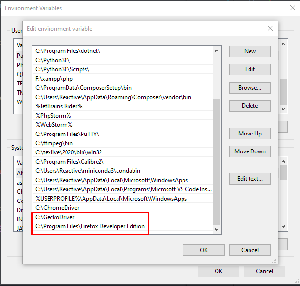

[Original README](https://github.com/jonbakerfish/TweetScraper/tree/c8bb0d74e2265f3aafb93023c3b3c1fef40ba117)

Scrapper originally by: https://github.com/jonbakerfish/TweetScraper

# Requirements

1. Conda (baik menggunakan miniconda / Anaconda)
2. Python 3.8 (akan diisntal pakai conda)
3. Chrome WebDriver

# Installation

## Conda

- Install conda baik melalui miniconda/Anaconda, berikut link miniconda (hanya ~400 mb dependencies, apabila Anaconda bisa sampai 3GB) - [link miniconda](https://docs.conda.io/en/latest/miniconda.html)

```
# Pastikan conda sudah terinstall dengan baik, uji dengan menjalankan perintah berikut melalui cmd:

conda --version
```

- Clone repository ini

> Note, kalau tidak punya git download disini https://git-scm.com/ (Windows)

```
git clone https://github.com/nadhifikbarw/ep-scrapper
cd ep-scrapper
```

- Setup environment untuk scrapper

```
conda init
conda create -n ep-scrapper python=3.8 -y
conda activate ep-scrapper
conda install -y -c conda-forge scrapy ipython ipdb
```

## Gecko WebDriver

Download Gecko WebDriver

1. [Download Gecko WebDriver - Windows](https://github.com/mozilla/geckodriver/releases/download/v0.27.0/geckodriver-v0.27.0-win64.zip)

2. Extract file

3. Pastikan geckodriver dan firefox tercantum di Environment Variable




## Data Processor

Untuk menjalankan processor gunakan script `processor.py`, pastikan gunakan conda env

```
conda activate ep-scrapper
python3 processor.py
```

Output processor akan berada pada file `out.csv`
